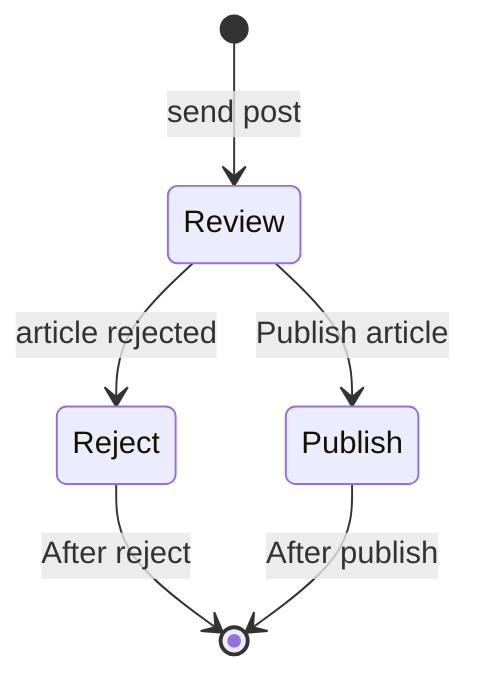

### description

Simple example about roles and FSM.

### diagram


### start 

in postgresql:

`create database test;`

`npm i`

`cp .env.example .env`

`npx prisma migrate dev --name init`

`npx prisma seed`

if you want create another seeder,after that run:

`npx prisma migrate reset`

`npm run start:dev`

### test
admin can't create post, we validate if is admi by email.

`localhost:3000/posts`

```
{
   "title":"flux zone come back",
   "authorEmail":"alice@prisma.io"
}
```
`Not Authorized`

admin can approve/reject post

`localhost:3000/posts/1/publish`

```
{
   "userId":"1"
}
```

`localhost:3000/posts/1/reject`

```
{
   "userId":"1"
}
```

### note

I'm not implementing session/cookies, it's just a simple example of Implementing State Machines (FMS) with roles assigned.